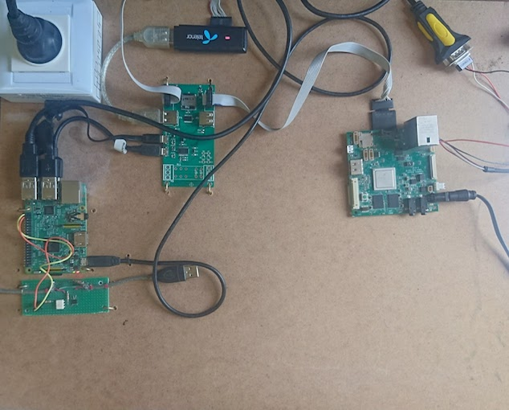

# Overview

Mentor Test Device Agent (or MTDA for short) is a relatively small Python application
acting as an interface to a test device. It provides mechanisms to remotely turn the
device on or off (assuming an IP/USB power switch is available), plug USB devices in
or out (also requiring special hardware) or simply access its console (in most cases
serial).

# Configurations

## Base

In its most basic configuration, MTDA may be used with:

   * a computer running Ubuntu
   * a target device
   * a serial connection between the two

In this configuration, power and USB control functions will not be available.

## BBB + Power switch

A basic configuration for targets booting from USB (mass storage) may be comprised of:

   * a BeagleBone Black connected via Ethernet and running mtda as a daemon
   * a target device
   * a serial connection between the two
   * an Aviosys 8800 power switch (connected via USB to the BBB)
   * a USB cable connected to the function port of the BBB and to the target

## Pi3 + Power/SD/USB switches

A more sophisticated, yet affordable, configuration may look like this:

   * a Raspberry Pi3 connected to your Wi-Fi network and running mtda as a daemon
   * a target device
   * a serial connection between the two
   * an Aviosys 8800 power switch (connected via USB to the Pi3)
   * a home-made USB switch (connected via GPIO to the Pi3)
   * Samsung's SD-Mux (connected via USB)



In this configuration, the target device may be used from computers running MTDA as
a client and connecting to the remote agent.

# Setup

For hosts running Ubuntu 18.04 (or later), the following packages need to be installed:

```
sudo apt-get install \
   python3-daemon python3-dev python3-serial \
   python3-setuptools python3-usb python3-zmq
```

The setup script should then be used to install command-line scripts and packages:

```
sudo python3 setup.py install
```

# Samsung SD-Mux

If you have a Samsung SD-Mux device, the following packages should be installed as well:

```
sudo apt-get install \
   cmake libfdt-dev libpopt-dev
```

You may then get the sd-mux-ctrl code and build it:

```
git clone https://git.tizen.org/cgit/tools/testlab/sd-mux
cd sd-mux
mkdir build
cd build
cmake ..
make
sudo make install
```

# Configuring MTDA

The agent reads its configuration from mtda.ini.
Check the sample configuration file included with this distribution for supported options.

# Starting the daemon

The MTDA daemon may be started as follows:

```
$ sudo mtda-cli -d
```

A daemon/server process will be needed to collect console output in the background and
dispatch it to connected MTDA clients.

# Client commands

Here are a few commands supported by mtda:

```
# Tell the client to connect to a remote MTDA agent
export MTDA_REMOTE=192.168.0.104

# Turn the target on
$ mtda-cli target on

# Send the "run boot_usb" command to the boot-loader
$ mtda-cli console send "run boot_usb\n"

# Get the first line from the console buffer
$ mtda-cli console head

# Return number of lines available from the console buffer
$ mtda-cli console lines
14

# Clear the console buffer
$ mtda-cli console clear
U-Boot 2015.07 (Jan 08 2017 - 16:25:06 +0100)

# Flush the console buffer
$ mtda-cli console clear

# Configure the target prompt
$ mtda-cli console prompt "# "

# Run a command via the console
$ mtda-cli console run "ls /"

# Interact with the console
$ mtda-cli
# The interactive console may alse be invoked as follows:
$ mtda-cli console interactive

# Power off the target
$ mtda-cli target off

# Attach the SD card to the host
$ mtda-cli sd host

# Write a compressed image to the SD card
# Compressed images (gzip'ed or bzip'ed) are supported
$ mtda-cli sd write console-image.wic.bz2
$ mtda-cli sd write console-image.wic.gz

# Attach the SD card to the target
$ mtda-cli sd target

# Power on the target
$ mtda-cli target on
```

# Interactive console

The 'console interactive' command allows remote interaction with the device console.
The following key sequences may be used to control MTDA:

   * Ctrl + a + a: acquire the target
   * Ctrl + a + i: print target information (power status, SD card, USB ports, etc.)
   * Ctrl + a + p: toggle power on/off
   * Ctrl + a + q: quit
   * Ctrl + a + r: release the target
   * Ctrl + a + s: switch SD card between the host and target (target shall be OFF)
   * Ctrl + a + t: toggle display of timestamps
   * Ctrl + a + u: toggle the 1st USB port on/off

